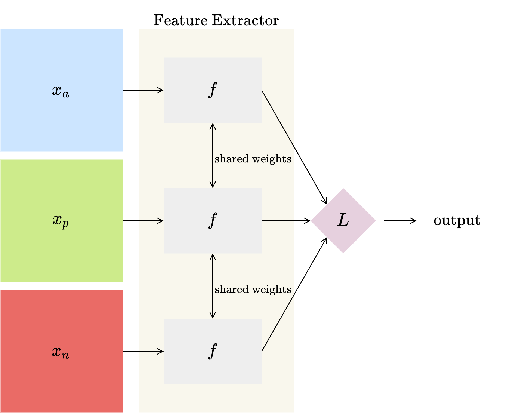
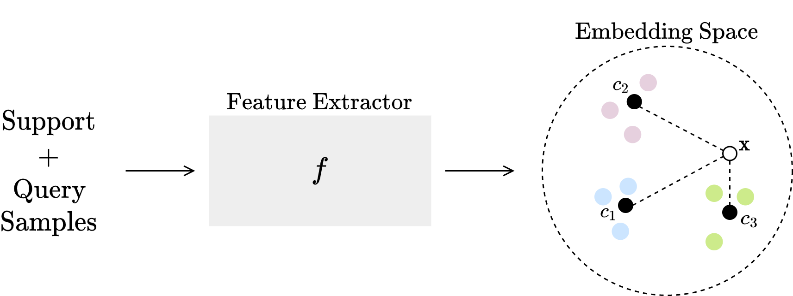

# Few-shot Learning for Biotic Stress Classification of Coffee Leaves
This repository contains the code developed in my graduation project. The codes are ready to be used in the Google Colab environment.

## Triplet Networks

The Google Colab notebook is found in `./siamese_triplet_net/run_siamese_triplet.ipynb`. The code used in this section uses part and is based on [this](https://github.com/adambielski/siamese-triplet) . Check his work out, it is really well documented.

## Prototypical Networks

The Google Colab notebook can be found in  `./protonet/run_protonet.ipynb`. This code was built on top of the one by [learn2learn](https://github.com/learnables/learn2learn/).

